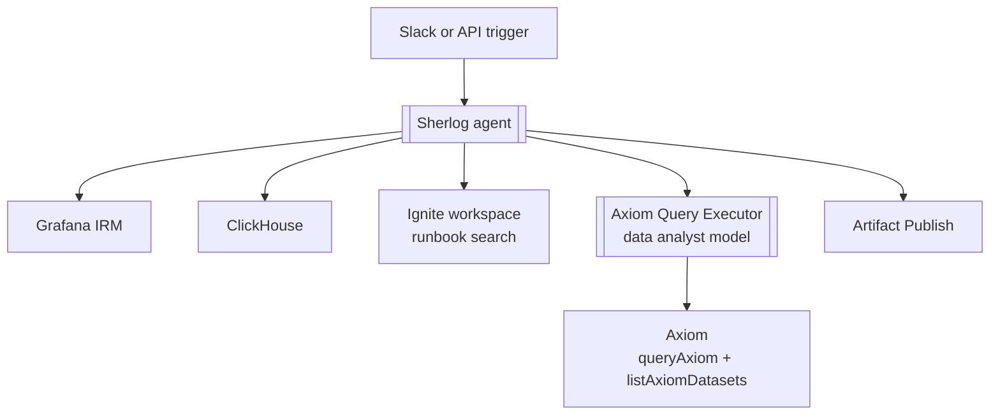

---
layout: cover
# background: ./theme/public/texture.jpg
---

# Sherlog

## Sub-agents and open-weight models on the frontlines

<div class="mt-10 flex items-center gap-3 text-lg opacity-80">
  <span class="bg-brand-stripes h-2 w-16 rounded-full" />
  <span>How we use Mastra to build an operations-health agent</span>
</div>

<!--
Welcome. This is a story about two design choices that have held up in production.
Sherlog uses a sub-agent to keep high-volume log data out of the main context.
The whole system runs on open-weight models.
-->

---
layout: iframe
title: Triaging an incident
url: https://share.descript.com/embed/naiMieLKEvY
---

---
layout: about-me
---

<!--
I work on platform architecture at Prisma.
This workshop is based on the Sherlog implementation and the trade-offs we made while operating it.
-->

---
layout: statement
---

<center>


</center>

Your TypeScript app from prompt to production.

---
layout: two-cols-header
---


::left::

## Prisma Compute

TypeScript application hosting running Bun

## Prisma Postgres

Serverless Postgres without cold starts

## Prisma Storage

S3 compatible storage backed by Tigris

::right::

<v-click>

## Prisma ORM

TypeScript ORM designed for agentic coding

## Prisma Migrate

Database migrations made easy

## Prisma Studio

Data exploration UI

</v-click>

<!--
We've found that agents work best with a well integrated system.

Prisma Cloud offers the building blocks your agent needs to build a modern full stack app under one provider.

Prisma ORM, Migrate, and Studio are open source projects we offer to bring the same agent-first mindset to database development.
-->

---

# Today's plan

What we'll cover

<v-clicks>

- **What is Sherlog?**
  - An introduction to our SRE agent
- **Architecture overview**
  - How Sherlog does its job
- **Context-heavy tasks**
  - Why we use sub-agents
- **Open-weight models in practice**
  - Why we use open-weight models

</v-clicks>

---
layout: section
---

# What is Sherlog?

The Slack-native operations-health assistant.

---
layout: image-right
image: /sherlog.png
---

# Sherlog

_It is a capital mistake to theorize before one has data. - Sherlock Holmes_

Sherlog has access to all of our telemetry to assist with platform operations.

<v-clicks>

- **Axiom**
  - OpenTelemetry traces
  - Application logs
- **ClickHouse**
  - Application metrics
  - ClickHouse health
- **Ignite** (our internal knowledge repo)
  - Product context
  - Runbooks
  - Query examples

</v-clicks>

---

# Slacking off

Sherlog lurks in Slack until it can be helpful

<div class="grid grid-cols-2 gap-4 mt-8">

<div class="rounded-xl border-l-brand-stripes p-4">

### Production incidents

Every message in our incidents channel is visible to Sherlog.

</div>

<div class="rounded-xl border-l-brand-stripes p-4">

### Slack DM

Ask directly when you need an investigation started.

</div>

<div class="rounded-xl border-l-brand-stripes p-4">

### @-mention

Bring Sherlog into another channel when the context already lives there.

</div>

<div class="rounded-xl border-l-brand-stripes p-4">

### Mastra Studio and API

Test the agent or trigger programmatically.

</div>

</div>

---
layout: section
---

# Architecture overview

---

# Sherlog investigation loop



<!--

Sherlog can:
- Create and update incidents in Grafana IRM
  - Useful for tracking Sherlog's research
- Query ClickHouse
- Access our knowledge base (Ignite)
- Dispatch queries to a sub-agent
- Publish artifacts (any text content)

-->

---
layout: section
---

# Context-heavy tasks

Where sub-agents become load bearing and earn their keep

---
layout: two-cols-header
---

# Mastra agents as tools for agents

Optimizing context retrieval

::left::

### Parent sees

The sub-agent’s description becomes the callable tool description.

### Parent receives

Only the sub-agent’s final output. Its intermediate calls and raw results stay isolated.

::right::

```ts {all|2-11|12-14|all}
export const sherlog = new Agent({
  tools: {
    createIncident,
    findActiveIncidents,
    updateIncident,
    addActivity,
    runClickHouseQuery,
    publishArtifact,
    getArtifact,
    deleteArtifact,
  },
  agents: {
    axiomQueryExecutor,
  },
})
```

<!--
This is a first-class Mastra feature.
Invoking the generated tool drives the sub-agent’s own generate loop.
-->

---
layout: two-cols-header
---

# Why Axiom needs a boundary

Exploratory research costs context

::left::


### Single agent

<v-clicks>

- Accidental unbound queries
- Multi-iteration queries
- Diminished aggregation quality
- Context compaction uncertainty

</v-clicks>

::right::

<v-click>

### Sub-agent

</v-click>

<v-clicks>

- Fresh starting context
- Clear, simple objective
- Simple, lightweight result
- Offload all research context

</v-clicks>

---

# An agent on a mission

<div class="grid grid-cols-3 gap-4 mt-10 text-center">
<div class="rounded-xl border p-5"><div class="text-sm opacity-50">Sherlog</div><div class="text-xl mt-3">Form a hypothesis</div><div class="text-sm opacity-60 mt-2">Decide what to ask next</div></div>
<div class="rounded-xl border border-brand-blue/40 p-5"><div class="text-sm opacity-50">Executor</div><div class="text-xl mt-3">Run APL query</div><div class="text-sm opacity-60 mt-2">Inspect raw rows in isolation</div></div>
<div class="rounded-xl border p-5"><div class="text-sm opacity-50">Finding</div><div class="text-xl mt-3">Distill evidence</div><div class="text-sm opacity-60 mt-2">Return signal, not rows</div></div>
</div>

<div class="mt-8 text-center text-sm opacity-70">The executor returns: hypothesis result · summary · key metrics · affected tenants · follow-up suggestion.</div>

---

# When not to sub-agent

The single responsibility principle was a lie

<v-click>

### Common mistakes:

</v-click>

<v-clicks>

- Sub-agent for speed
  - A sub-agent needs context and will duplicate steps
- Sub-agent for cost
  - Duplicative, diverging context also duplicates cache and burns more tokens
- Sub-agent for responsibilities
  - Doesn't help if the orchestrator can invoke the subagent with any instruction it wants
  - Better to add deterministic tool guardrails than rely on sub-agent isolation
- Sub-agents for workflow orchestration
  - Mastra workflows are failure resilient
  - Workflow steps can be deterministic functions or agent executions

</v-clicks>

---

# What we did not delegate

<div class="grid grid-cols-3 gap-4 mt-10">
<div class="rounded-xl border p-5"><h3>Runbook Locator</h3><p>Searching the workspace is cheap, and the runbook content is valuable.</p></div>
<div class="rounded-xl border p-5"><h3>Incident Classifier</h3><p>Simple task, benefiting from expansive context.</p></div>
<div class="rounded-xl border p-5"><h3>ClickHouse investigator</h3><p>Less exploratory. Deferred until the context actually becomes polluted.</p></div>
</div>

<div class="mt-10 text-center text-xl">A separable task is not automatically a sub-agent.</div>

---
layout: section
---

# Open-weight models in practice

Behind the frontier and ahead of the curve  

---
layout: fact
---

# 100%

Open-weight models across Sherlog, Gremlin, and Gizmo agents.

<!--
-->

---

# Route by role, not by brand

Choose your fighter

| **Role** | **Used by** |
|---|---|
| Reasoning | Sherlog, Gremlin |
| Code review | Gizmo |
| Data analysis | Axiom executor |
| Summarizing | Changelog |
| Classification | Routing tasks |
| Structuring | Extraction passes |

<div class="mt-5 text-sm opacity-60">All mappings live in one small model configuration file.</div>

---

# Route by role, not by brand

Our model selection a few weeks ago

| **Role** | **Primary → fallback** |
|---|---|
| Reasoning | GLM-5.2 → Kimi K3 |
| Data analysis | MiniMax M3 → M2.7 |
| Summarizing | MiniMax M3 → M2.7 |
| Classification | MiniMax M3 → M2.7 |

---

# Route by role, not by brand

Our model selection now

| **Role** | **Primary → fallback** |
|---|---|
| Reasoning | GLM-5.3-flash → GLM-5.3 → Kimi K3 |
| Code review | GLM-5.3-flash → GLM-5.3 |
| Data analysis | GLM-5.3-flash → MiniMax M3 → M2.7 |
| Summarizing | GLM-5.3-flash → MiniMax M3 → M2.7 |
| Classification | GLM-5.3-flash → MiniMax M3 → M2.7 |
| Structuring | GLM-5.3-flash |

<!--
GLM-5.3-flash has a great balance of capability, speed, and cost.
-->

---

# Grouping models by roles

```ts {all|3-7|9-14|16-21}
import type { ModelWithRetries } from "@mastra/core/agent";

const GLM_5P3 = "fireworks-ai/accounts/fireworks/models/glm-5p3";
const GLM_5P3_FLASH = "fireworks-ai/accounts/fireworks/models/glm-5p3-flash";
const KIMI_K3 = "fireworks-ai/accounts/fireworks/models/kimi-k3";
const MINIMAX_M3 = "fireworks-ai/accounts/fireworks/models/minimax-m3";
const MINIMAX_M2P7 = "fireworks-ai/accounts/fireworks/models/minimax-m2p7";

/** Model for tasks that need strong reasoning capability and reliable tool calling. */
export const REASONING_MODEL: ModelWithRetries[] = [
  { model: GLM_5P3_FLASH, maxRetries: 3 },
  { model: GLM_5P3, maxRetries: 3 },
  { model: KIMI_K3, maxRetries: 3 },
];

/** Cheaper model for text classification and routing tasks. */
export const CLASSIFIER_MODEL: ModelWithRetries[] = [
  { model: GLM_5P3_FLASH, maxRetries: 3 },
  { model: MINIMAX_M3, maxRetries: 3 },
  { model: MINIMAX_M2P7, maxRetries: 3 },
];
```

---
layout: statement
---

# Summarizing text is not a Fable-class problem.

Save the frontier-scale models for frontier-scale work.

---
layout: section
---

# Takeaways

---

# Three rules from Sherlog

<div class="grid grid-cols-3 gap-5 mt-10">
<div class="rounded-xl border border-brand-blue/40 p-5"><div class="text-4xl text-brand-blue">01</div><h3 class="mt-5">Protect context</h3><p>Add a sub-agent when raw high-volume data would otherwise flood the main agent.</p></div>
<div class="rounded-xl border border-brand-red/40 p-5"><div class="text-4xl text-brand-red">02</div><h3 class="mt-5">Route by role</h3><p>Use a stronger model for orchestration. Use a cheaper model for focused work.</p></div>
<div class="rounded-xl border border-brand-yellow/40 p-5"><div class="text-4xl text-brand-yellow">03</div><h3 class="mt-5">Keep it adjustable</h3><p>Put model choices in one config layer so routing can evolve without rewiring agents.</p></div>
</div>

<!--
Use sub-agents when the context is isolated from the parent/siblings and disposable.

Think about models by role, then swapping roles becomes trivial.

Configure models by role in one place for easy editing.
-->

---

# Thank you
